## ALL LAYERS

| # | Layers | Mining Time | Min Support | Min Nodes | Dataset | Total Models | Patterns found | Top 3 Patterns |
|---|--------|-------------|-------------|-----------|---------|--------------|----------------|----------------|
| trial_0 | all_layers | 900 s | 10 | 8 | 50_200 | 100 | 5320 | 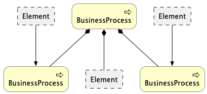  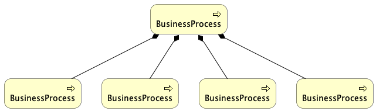 |
| trial_1 | all_layers | 900 s | 20 | 8 | 50_200 | 200 | 4349 | 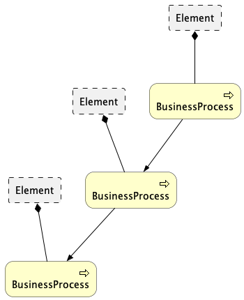  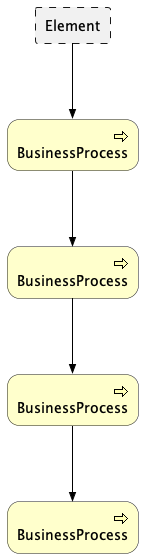 |
| trial_2 | all_layers | 900 s | 30 | 8 | 50_200 | 300 | 485 |   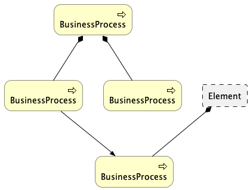 |
| trial_3 | all_layers | 900 s | 40 | 8 | 50_200 | 400 | 7 | 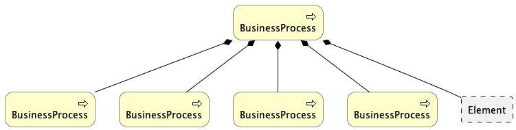  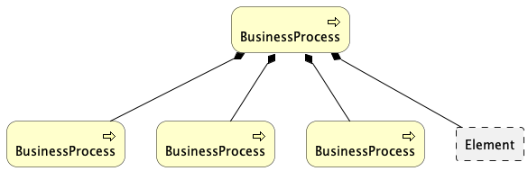 |
| trial_4 | all_layers | 300 s | 10 | 4 | 100_500 | 229 | 34 |   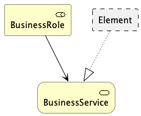 |
| trial_5 | all_layers | 1800 s | 8 | 4 | 100_500 | 229 | 57 | 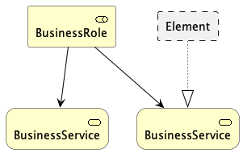 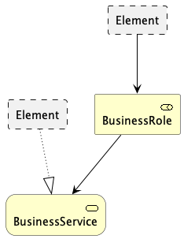  |
| trial_6 | all_layers | 300 s | 5 | 4 | 100_500 + 200_500 | 292 | 258 | 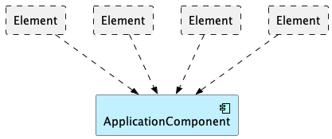 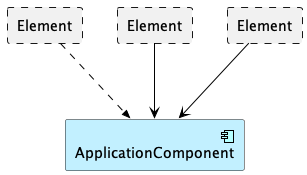 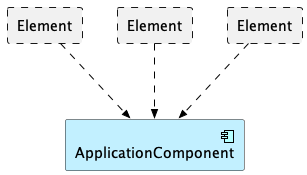 |
| trial_7 | all_layers | 300 s | 5 | 4 | 100_1000 | 245 | 221 | 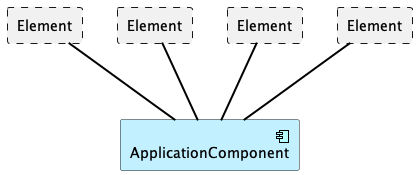 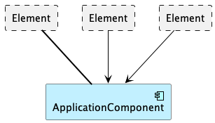  |
| trial_8 | all_layers | 3600 s | 5 | 4 | 100_1000 | 245 | 330 |    |
| trial_9 | all_layers, no application layer | 3600 s | 5 | 4 | 100_1000 | 245 | 748 |  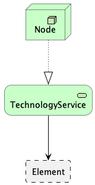 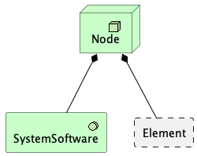 |

## SINGLE LAYERS

| # | Layers | Mining Time | Min Support | Min Nodes | Dataset | Total Models | Patterns found | Top 3 Patterns |
|---|--------|-------------|-------------|-----------|---------|--------------|----------------|----------------|
| trial_0 | application_layer | 900 s | 20 | 8 | 50_200 | 300 | 6 |    |
| trial_1 | business_layer | 900 s | 20 | 8 | 50_200 | 300 | 332 |    |
| trial_2 | motivation_layer | 900 s | 10 | 4 | 50_200 | 300 | 42 |    |
| trial_3 | strategy_layer | 900 s | 8 | 4 | 50_200 | 300 | 3 |    |
| trial_4 | technology_layer | 900 s | 8 | 4 | 50_200 | 300 | 240 |    |
| trial_5 | technology_layer | 900 s | 20 | 4 | 50_200 | 300 | 14 |    |
| trial_6 | motivation_layer | 300 s | 10 | 4 | 100_500 | 229 | 168 |    |
| trial_7 | motivation_layer | 300 s | 10 | 4 | 100_500 + 200_500 | 292 | 415 |    |
| trial_8 | business_layer | 3600 s | 60 | 4 | 100_1000 | 292 | 38 |    |

## COMBINED LAYERS

| # | Layers | Mining Time | Min Support | Min Nodes | Dataset | Total Models | Patterns found | Top 3 Patterns |
|---|--------|-------------|-------------|-----------|---------|--------------|----------------|----------------|
| trial_0_0 | business + application | 900 s | 10 | 8 | 50_200 | 300 | 503 |    |
| trial_0_1 | business + application | 900 s | 10 | 12 | 50_200 | 300 | 7 |    |
| trial_0_2 | business + strategy | 900 s | 20 | 8 | 50_200 | 300 | 449 | No images found |
| trial_0_3 | business + motivation | 900 s | 10 | 8 | 50_200 | 300 | 30 | No images found |
| trial_0 | business + application + technology | 1800 s | 10 | 6 | 100_1000 | 245 | 53 |    |
| trial_1_0 | application + technology | 900 s | 20 | 8 | 50_200 | 300 | 13 | No images found |
| trial_1_1 | application + motivation | 900 s | 20 | 8 | 50_200 | 300 | 6 | No images found |
| trial_1_2 | application + technology + physical | 900 s | 20 | 8 | 50_200 | 300 | 13 | No images found |
| trial_1_3 | application + technology + physical | 900 s | 10 | 8 | 50_200 | 300 | 33 | No images found |
| trial_1 | application + technology + other | 900 s | 8 | 6 | 100_1000 | 245 | 211 | No images found |
| trial_2_0 | motivation + strategy | 900 s | 10 | 6 | 50_200 | 300 | 0 | No images found |
| trial_3_0 | implementation & migration + physical + technology | 900 s | 10 | 8 | 50_200 | 300 | 28 | No images found |
| trial_3_1 | implementation & migration + motivation + other + strategy | 900 s | 10 | 8 | 50_200 | 300 | 0 | No images found |
| trial_2 | technology + physical + implementation_migration | 900 s | 8 | 6 | 100_1000 | 245 | 56 | No images found |
| trial_3 | motivation + strategy + other | 900 s | 8 | 6 | 100_1000 | 245 | 1 | No images found |
| trial_4 | application + technology + physical | 900 s | 10 | 8 | 100_1000 | 245 | 22 | No images found |
| trial_5 | motivation + strategy + other + implementation_migration | 900 s | 8 | 8 | 100_1000 | 245 | 0 | No images found |
