| # | Layers | Mining Time | Min Support | Min Nodes | Dataset | Total Models | Patterns found | Top 3 Patterns |
|---|--------|-------------|-------------|-----------|---------|--------------|----------------|----------------|
| trial_0 | application_layer | 900 s | 20 | 8 | 50_200 | 300 | 6 | 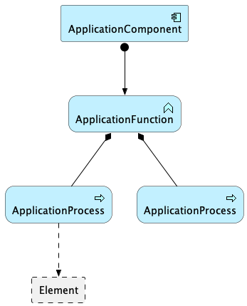 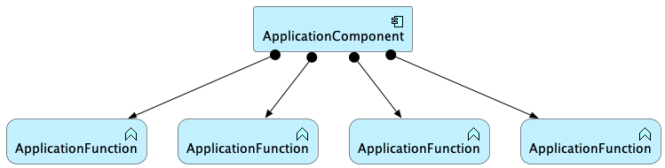 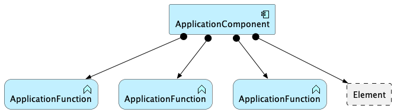 |
| trial_1 | business_layer | 900 s | 20 | 8 | 50_200 | 300 | 332 |    |
| trial_2 | motivation_layer | 900 s | 10 | 4 | 50_200 | 300 | 42 | 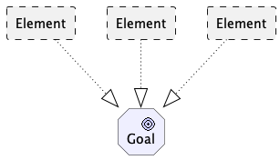  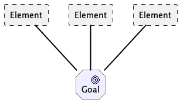 |
| trial_3 | strategy_layer | 900 s | 8 | 4 | 50_200 | 300 | 3 | 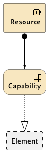 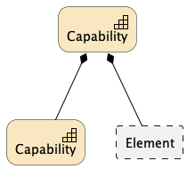 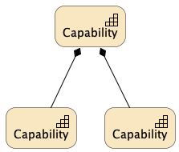 |
| trial_4 | technology_layer | 900 s | 8 | 4 | 50_200 | 300 | 240 | 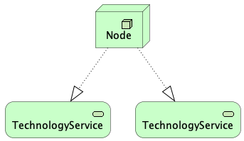 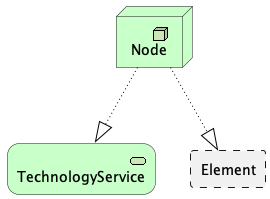  |
| trial_5 | technology_layer | 900 s | 20 | 4 | 50_200 | 300 | 14 |   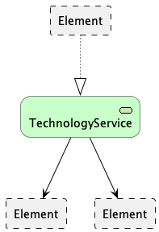 |
| trial_6 | motivation_layer | 300 s | 10 | 4 | 100_500 | 229 | 168 | 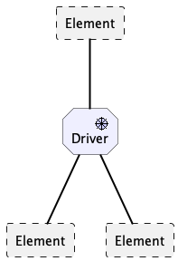 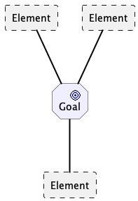  |
| trial_7 | motivation_layer | 300 s | 10 | 4 | 100_500 + 200_500 | 292 | 415 | 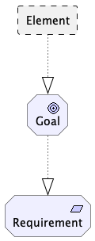  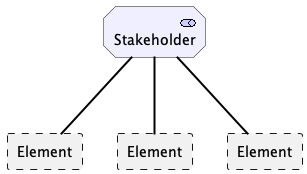 |
| trial_8 | business_layer | 3600 s | 60 | 4 | 100_1000 | 292 | 38 | 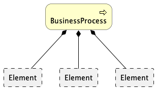 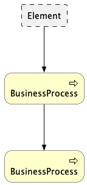 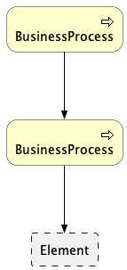 |
